# SALEEM Luxury Salon Management Ecosystem

## Overview

SALEEM Luxury Salon Management Ecosystem is a complete salon operations platform designed to streamline customer flow, barber allocation, billing, and business management.

The project was inspired by workflow inefficiencies commonly observed in local men's salons, where customer queues, barber assignments, billing records, and customer history are often managed manually.

The objective was to design a centralized system that improves operational efficiency and customer experience through automation and real-time visibility.

---
## Why I Built This Project

This project was created as an attempt to understand and solve operational challenges that are commonly seen in local salon businesses.

While observing salon workflows, I noticed that many day-to-day activities such as customer queue management, barber assignment, billing, customer history tracking and business reporting were often handled manually.

I wanted to explore how a centralized software solution could improve efficiency, reduce waiting time, improve customer experience and provide business insights for salon owners.

The result was the SALEEM Luxury Salon Management Ecosystem - a complete salon operations platform that combines customer management, CRM, billing, analytics, employee management and queue automation into a single system.

## Problem Statement

Many local salons face challenges such as:

* Manual queue handling
* Unorganized customer flow
* Difficulty tracking barber availability
* Manual billing processes
* No customer relationship management
* Limited business analytics
* Lack of operational visibility

These issues can increase waiting times, reduce efficiency, and make business tracking difficult.

---

## Proposed Solution

SALEEM Luxury Salon OS provides:

* Customer Management System
* Smart Token Generation
* VIP Priority Queue
* Automatic Barber Assignment
* Active Customer Tracking
* Billing & Payment Processing
* Customer CRM
* Membership Management
* Analytics Dashboard
* Inventory Management
* Employee Management
* TV Queue Display System
* Backup & Restore Support
* WhatsApp/SMS Integration
---

## Technology Stack

* HTML5
* CSS3
* Vanilla JavaScript
* LocalStorage Database

Future architecture supports:

* Firebase Integration
* MySQL Integration
* Cloud Synchronization

* online booking
* Multi-Branch Support

---

## Key Learning Outcomes

* Workflow Analysis
* Business Process Automation
* Frontend Architecture Design
* State Management
* Local Data Persistence
* Dashboard Development
* CRM System Design

---

## Project Status

Active Development

---

## Application Screenshots

### Dashboard

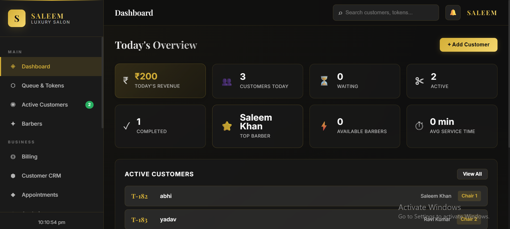

### Analytics

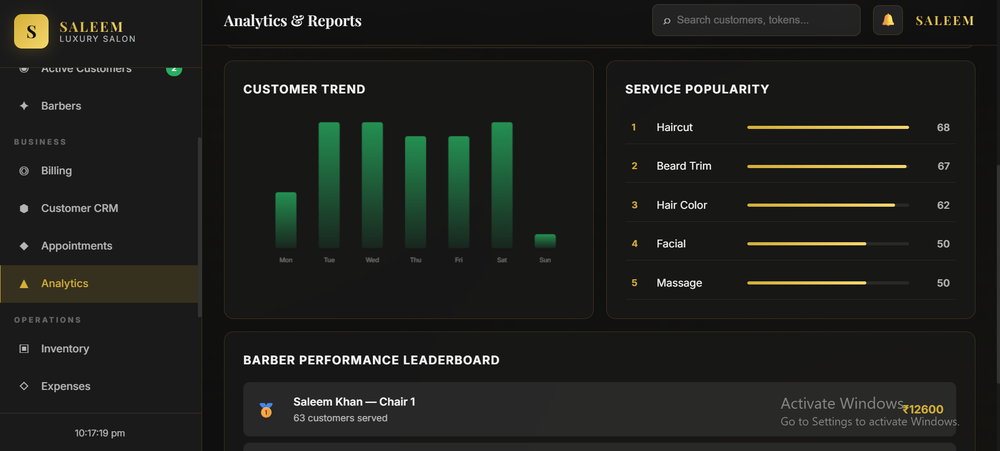

### Appointment Management

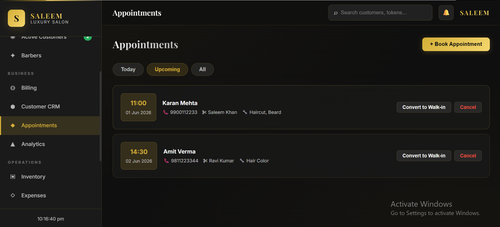

### Barber Management

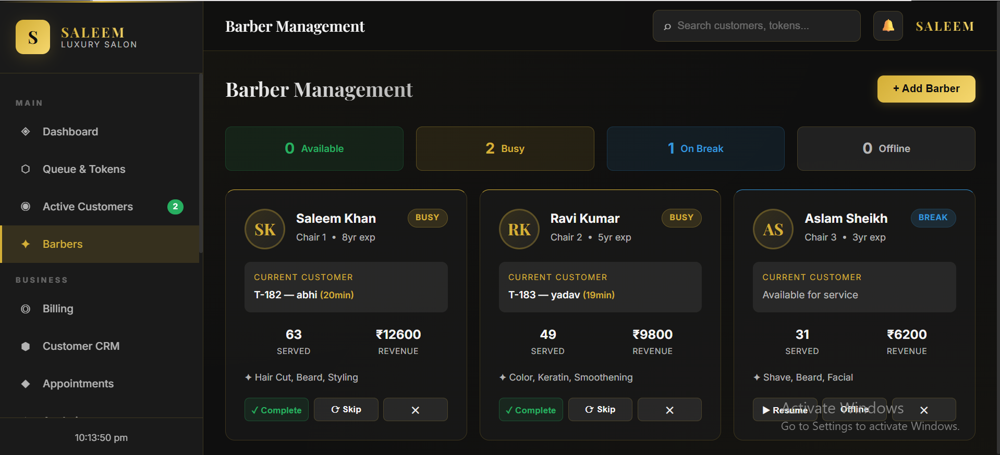

### Billing System

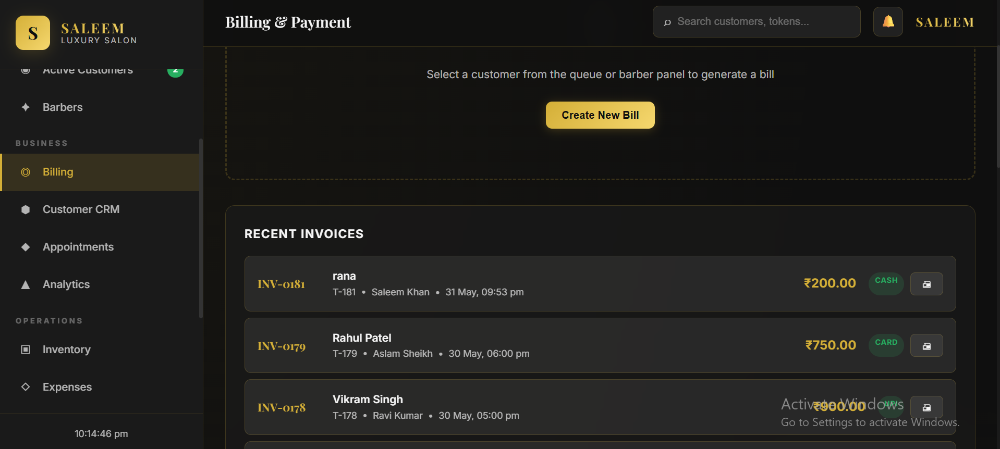

### Customer CRM

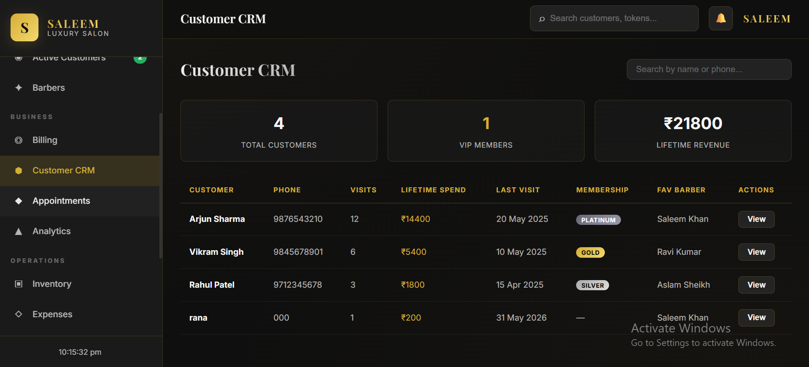

### Employee Management

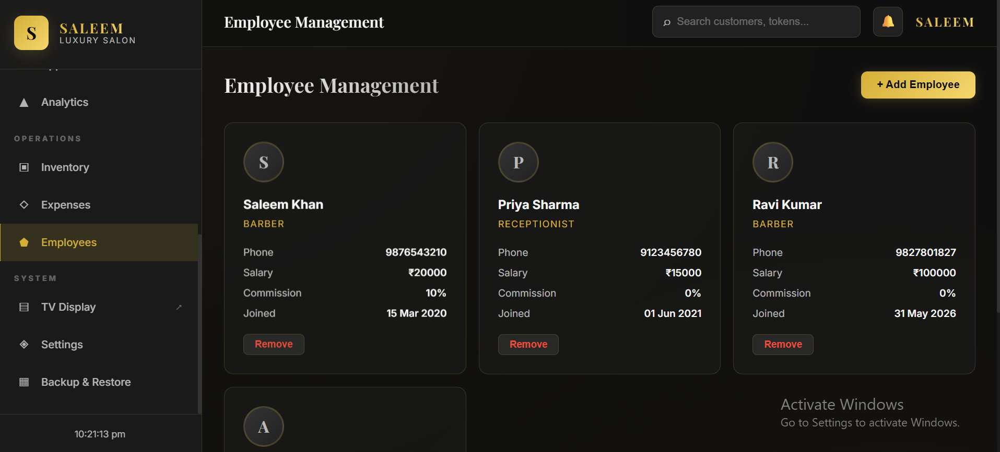

### Expense Management

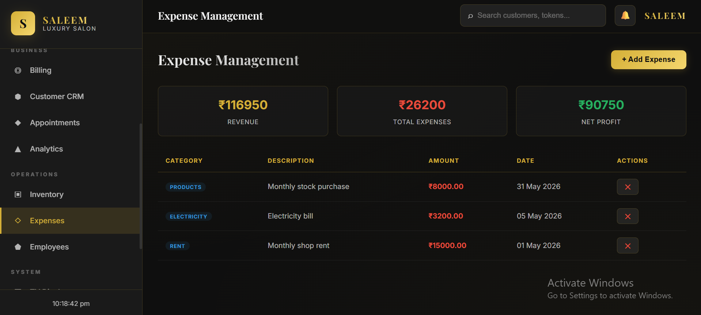

### Inventory Management

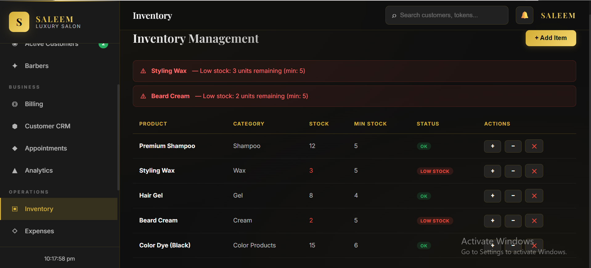

### Salon Settings

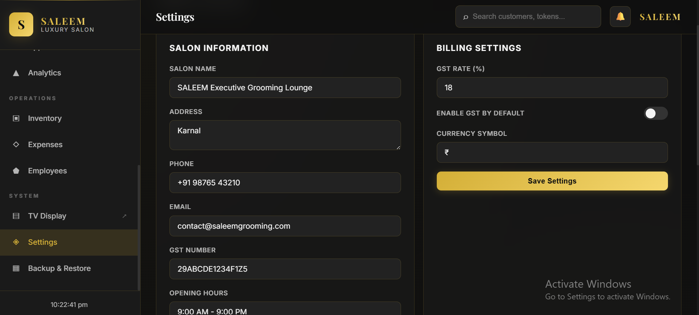

### Smart Token System

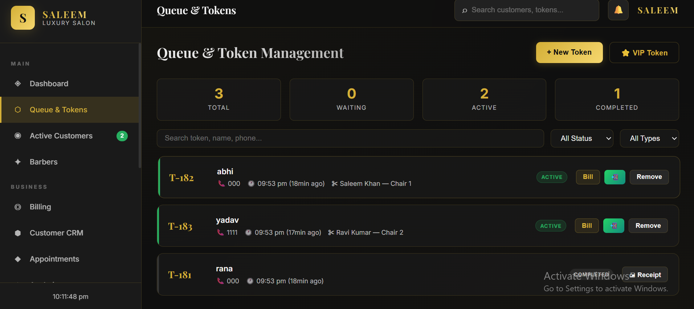

### TV Display Screen

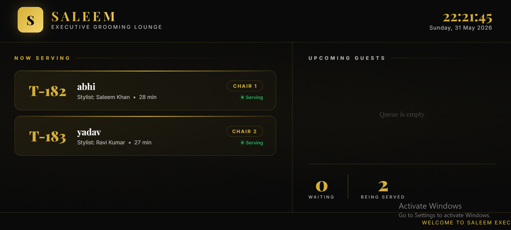

### WhatsApp & SMS Integration

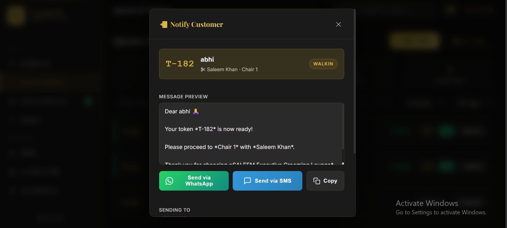
